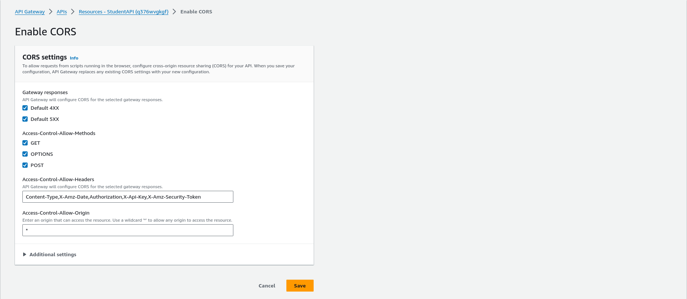
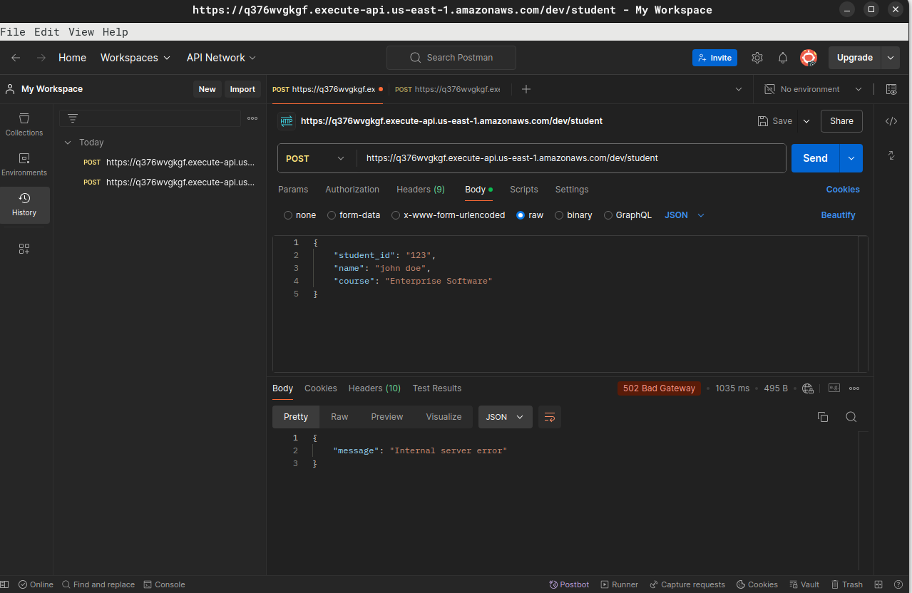

# Serverless Setup AWS Lambda + DynamoDB

## Set Up AWS services

### AWS Lambda

To start this project, I will first need to create a Lambda function.

1. So firstly, I went to Lambda dashboard and selected create a function. \
   
   _Note: I choose Node.JS runtime with a dynamoDB template. I also deferred the creation of API gateway for later._

2. Upon completion, the dashboard is updated with a new function
   

### AWS DynamoDB

1. DynamoDB will be where we store our student records. I went ahead to create a new table.
   
   _Note: Canvas specified student_id as a string so that's the choice._

2. The result is a table titled StudentRecords.
   

### AWS API Gateway

1. I went to API Gateway and selected Rest API.
   

2. The result is shown on the dashboard.
   

3. In the example on Canvas, it is noted that the api gateway has a segment /student. So I went ahead to add that as well.
   
   _Note: CORS is enabled so it can be accessed outside of its domain_

4. Next I will have to create the GET and POST methods to connect it with AWS Lambda function I made.
   
   _Note: GET function_

   
   _Note: POST function_

5. Once finished, the result should look like the picture below
   
   _Note: The OPTIONS method is for CORS functionality_

6. Then I will enable CORS.
   

7. I will go ahead and deploy the API now. I used "dev" as the stage name as it was provided in the canvas example. This will also give me the invoke URL for test.
   

That is all the steps for now. I can now begin tinkering with the AWS Lambda function code to process the requests.

## AWS Lambda Function Code

The boilerplate code provided doesn't do exactly do what I wanted so I'm going to edit its handler.

```
//The handler function
switch (event.httpMethod) {
            case 'DELETE':
                body = await dynamo.delete(JSON.parse(event.body));
                break;
            case 'GET':
                params.Key = {student_id: event.queryStringParameters.student_id};
                body = await dynamo.get(params);
                break;
            case 'POST':
                params.Item = JSON.parse(event.body);
                body = await dynamo.put(params);
                break;
            case 'PUT':
                body = await dynamo.update(JSON.parse(event.body));
                break;
            default:
                throw new Error(`Unsupported method "${event.httpMethod}"`);
        }
```

## Testing POST / GET

After deploying the function, api gateway, the logic is ready for test. I will be using Postman for these tests.

#### First try on POST - Failed

I need to populate the table first with a POST before I can try with a GET. So I wrote my query, hit submit, and got a big ol' error!


_Note: ERROR: 502 - Internal server error. Yikes this could mean anything is wrong_

So I spent sometime double checking deployment. Everything looked good so I googled around to look as
to where else I missed. People said to look at CloudWatch logs so I had to find that service. Sure enough there was a syntax error.


_Note: Whoops._

#### Second try on POST - Yay

After fixing the issue, I tried again to POST and it worked this time.


#### First try on GET

Now hopefully, with an entry of student*id = "123", I can go and query for it. And what do you know, it works! Whoohoo!

\_Note: John Doe is in Item*

## Optional: DELETE / PUT

1. Make changes to Lambda function code to allow for PUT and DELETE.

```
//handler function
try {
        switch (event.httpMethod) {
            case 'DELETE':
                params.Key = JSON.parse(event.body);
                body = await dynamo.delete(params);
                break;
            case 'GET':
                params.Key = {student_id: event.queryStringParameters.student_id};
                body = await dynamo.get(params);
                break;
            case 'POST':
                params.Item = JSON.parse(event.body);
                body = await dynamo.put(params);
                break;
            case 'PUT':
                params.Item = JSON.parse(event.body);
                body = await dynamo.put(params);
                break;
            default:
                throw new Error(`Unsupported method "${event.httpMethod}"`);
        }
```

2. Create methods on API Gateway similar to previous GET/POST and deploy. Then it is ready to be tested again.
   

## Testing all CRUD functions

#### Sequence

- To make this test comprehensive, I have deleted the previous test entries in the table.
- The sequence will be
  1. Create {student_id=123, name="RyanTan", "course"="AWS"}
  2. Create {student_id=321, name="FakeRyanTan", "course"="AWS"}
  3. Read {student_id=321}
  4. Delete {student_id=321}
  5. Read {student_id=321}
  6. Read {student_id=123}
  7. Update {student_id=123, name="TheRealRyanTan", "course=AWS"}
  8. Read {student_id=123}

#### Execution

1.  
    _Note: Create the first record_
    <br>
    <br>
2.  
    _Notes: Create the second record_
    <br>
    <br>

3.  
    _Notes: Read the second record, found item_
    <br>
    <br>
4.  
    _Notes: Delete the second record_
    <br>
    <br>

5.  
    _Notes: Read the seoncond Items not found_
    <br>
    <br>
6.  
    _Notes: Read the first record, found item_
    <br>
    <br>
7.  
    _Notes: Update the first record_
    <br>
    <br>
8.  
    _Notes: Read updated first record_
    <br>
    <br>
9.  
    _Notes: final result on DynamoDB_

## Challenges with AWS Lambda

1. Node.Js Runtime \
   I thought it would be fun to use a different runtime than the Python runtime provided because I wanted to write my own lambda code. Doing so helped me understand the event handler function more but it was also more work on my end. I had to look up documentation on the DynamoDBDocument class on Amazon SDK JS to know what to do.

2. Navigating AWS \
   I have had experience with AWS Lightsail and EC2 but navigating the interface of AWS proved challenging at times.
3. Debugging \
   It was hard to debug the Lambda code issue at first because I didn't know where to look. Now I know how to look for logs in CloudWatch thanks to Google and StackOverflow.
4. API Gateway \
   The steps on Canvas didn't provide a full example on how to deploy the API endpoints. I had to do a lot of tinkering to get the specifications correct to match what the example queries were. I actually enjoyed the lack of direction because it encouraged me to explore more within AWS/Google to find solutions.

## Takeaways

1. Serverless is another way to executing code than the traditional way. Instead of always having an instance running, you can just run code on demand.
2. Lambda function editor is somewhat subpar, I can imagine in most scenarioes an IDE is better.
3. DynamoDB is a document-based data table.
4. DynamoDB does not allow for duplicates. I tried inserting two identical student_id and only one entry existed.
5. Amazon does a pretty good job of integrating one service with another and after a while it's easy to use.
6. There are lots of resources online regarding AWS services.
